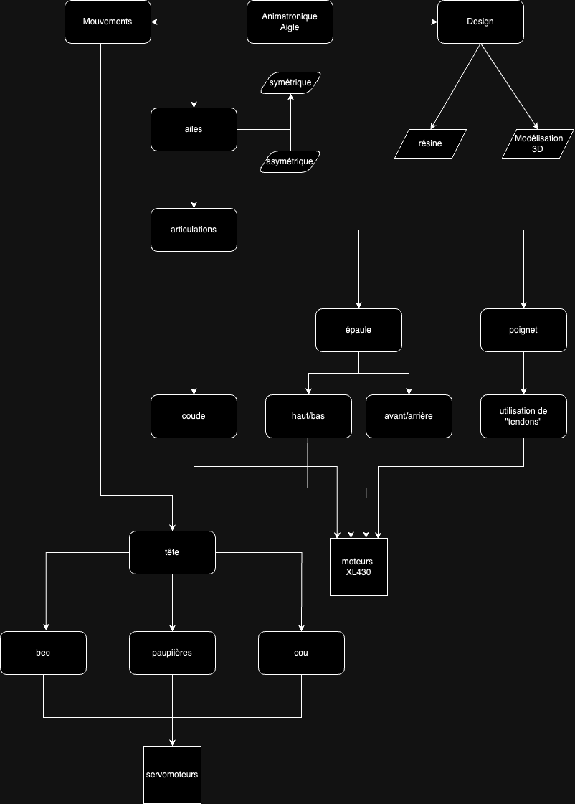
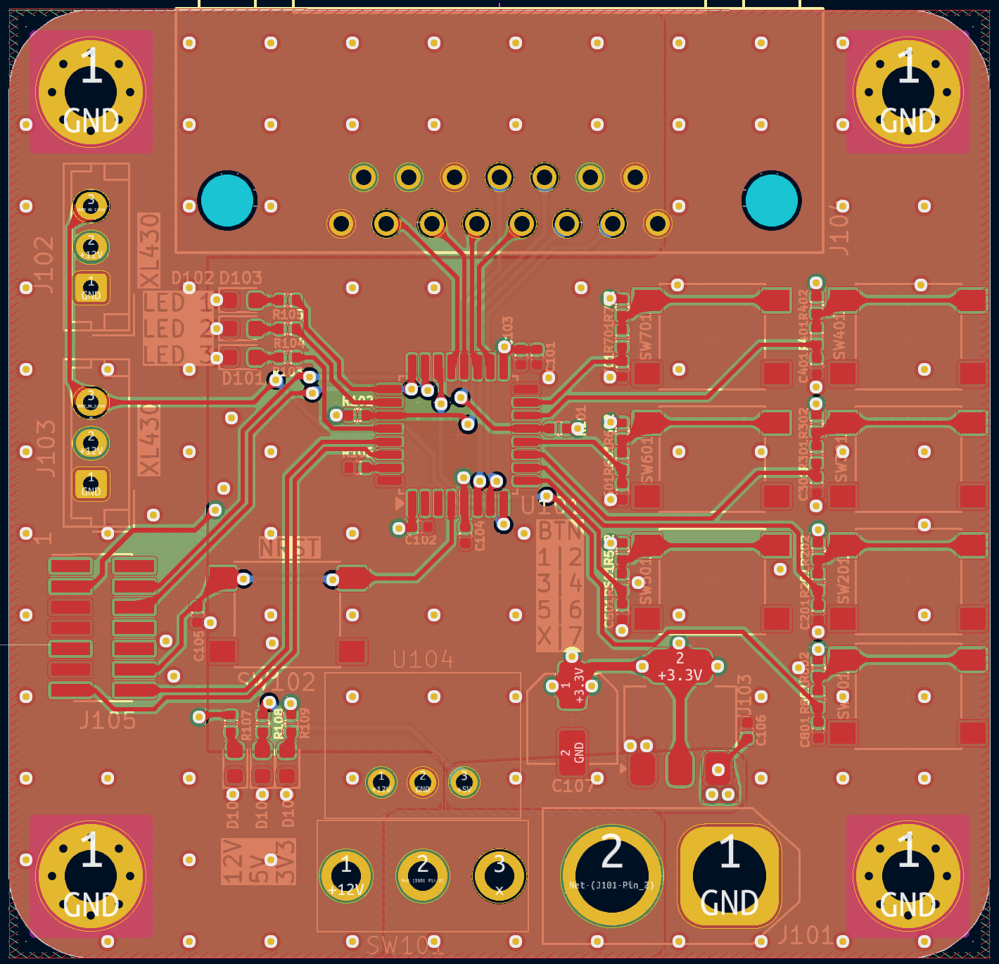

# DEA : Dynamic Eagle Animatronic

Depuis la Grêce antique et le mythe du géant de bronze Talos les hommes ont toujours cherchés à créer des automates avec les moyens à leur disposition. Les animatroniques sont l'achèvement actuel de ce désir. Ce sont des poupées mécaniques plus ou moins réalistes dont le fonctionnement interne fait intervenir autant de la mécanique que de l'électronique.
Elles sont depuis plusieurs décennies et encore aujourd'hui principalement utilisées dans le domaine du divertissement au travers des parcs d'attraction, des films et des séries.

Dans le cadre d'un projet de 1ère année à l'école d'ingénieur ENSEA supervisé par [M.Papazoglou](https://github.com/mael-lukas/2324_Projet1AB_Animatronic/tree/main#supervis%C3%A9-par-mpapazoglou) nous allons créer créer une animatronique d'aigle en 10 séances de 4h. Cet animatronic sera
capable d'ouvrir et de rabattre ses ailes, d'ouvrir et de fermer ses paupières, d'ouvrir et de fermer son bec, de pivoter sa tête (optionnel). Ces mouvements seront commandés par
l'appui de différents boutons.

<table>
  <tr>
    <td></td>
    <td></td>
  </tr>
</table>

  [Cahier des charges](https://github.com/mael-lukas/2324_Projet1AB_Animatronic/blob/main/GestionProjet/Cahier%20des%20charges%20(1).png)    
  [Diagramme d'architecture](https://github.com/mael-lukas/2324_Projet1AB_Animatronic/blob/main/GestionProjet/Diagramme_architecture.drawio.png)

# Equipe
Membres de l'équipe : 
* #### Vincent Fernandes
    * [Github](https://github.com/FernandesVincent)
    * [Linkedin](https://www.linkedin.com/in/vincent-fernandes-0981552a6/)
* #### Maël Lukas
    * [Github](https://github.com/mael-lukas)
    * [Linkedin](https://www.linkedin.com/in/mael-lukas/)
* ##### Romane Ponthieu
    * [Github](https://github.com/Romanepnth)
    * [Linkedin](https://www.linkedin.com/in/romane-ponthieu/)
* #### Marie Ceccaldi
    * [Github](https://github.com/mariececcaldi1)
    * [Linkedin](https://www.linkedin.com/in/marie-ceccaldi-887616300/)
* #### Sedrenn Labrousse
    * [Github](https://github.com/Sedrennl)
    * [Linkedin](https://www.linkedin.com/in/sédrenn-labrousse-24b2a5295/)

* #### Supervisé par Nicolas Papazoglou
    * [Github](https://github.com/DBXYD?tab=overview&from=2024-05-01&to=2024-05-29)
    * [Linkedin](https://www.linkedin.com/in/nicolas-papazoglou-38382646/?originalSubdomain=fr)

# Journal de bord

## Séance 1
   Cette séance, étant la première, nous a servit à définir notre projet au travers de la création d'une première version d'un cahier des charges et d'un diagramme d'architecture. Afin de nous organiser au mieux au vu du temps disponible à la création de ce projet nous nous sommes directement répartit différentes tâches à réaliser durant les semaines qui suivent.
   * #### modélisation 3D de l'aigle
        * [Sedrenn](https://github.com/mael-lukas/2324_Projet1AB_Animatronic/tree/main?tab=readme-ov-file#sedrenn-labrousse)
   * #### programmation des moteurs
        * [Maël](https://github.com/mael-lukas/2324_Projet1AB_Animatronic/tree/main?tab=readme-ov-file#ma%C3%ABl-lukas)
   * #### création des différents PCB
        * [Romane](https://github.com/mael-lukas/2324_Projet1AB_Animatronic/tree/main?tab=readme-ov-file#romane-ponthieu)
        * [Marie](https://github.com/mael-lukas/2324_Projet1AB_Animatronic/tree/main?tab=readme-ov-file#marie-ceccaldi)
        * [Vincent](https://github.com/mael-lukas/2324_Projet1AB_Animatronic/tree/main?tab=readme-ov-file#vincent-fernandes)

## Séance 2
   Durant cette séance nous avons affiné notre cahier des charges et notre diagramme d'architecture disponible ci-dessous:

   Nous en avons déduis la nécessité d'avoir un minimum de 2 PCB afin de réaliser notre animatronique, le principal qui contiendrait le microprocesseur ainsi que différents connectiques tandis que le secondaire incorporerai principalement en son sein tout les régulateurs de tension nécessaire à l'actionnment des moteurs. [PCB](https://github.com/mael-lukas/2324_Projet1AB_Animatronic?tab=readme-ov-file#pcb)
   Pendant ce temps, [Sedrenn](https://github.com/mael-lukas/2324_Projet1AB_Animatronic/tree/main?tab=readme-ov-file#sedrenn-labrousse) et [Maël](https://github.com/mael-lukas/2324_Projet1AB_Animatronic/tree/main?tab=readme-ov-file#ma%C3%ABl-lukas)
 se sont chargés de la commande des différents composants dont nous ne disposions pas à l'école.
   
## Séance 3
   À cette étape du projet nous avons choisis de créer un nouveau [PCB](https://github.com/mael-lukas/2324_Projet1AB_Animatronic/tree/main?tab=readme-ov-file#yeux) dans le but de pouvoir placer les LED RGB au plus proches des yeux de d'aigle. Ce PCB sera donc utilisé deux fois, un pour chaque oeil.
   En parallèle à cela, nous nous sommes penchés sur la réalisation d'un socle dont le but est d'accueillir le [PCB principal](https://github.com/mael-lukas/2324_Projet1AB_Animatronic/tree/main?tab=readme-ov-file#corps) ainsi que l'alimentation tout en permettant de poser l'aigle sur celui-ci pour y connecter l'ensemble des câbles.
   
## Séance 4
   Cette séance a permis la finalisation des schematic des 3 [PCB](https://github.com/mael-lukas/2324_Projet1AB_Animatronic?tab=readme-ov-file#pcb) crées sous Kicad et ainsi le passage à l'étape PCB editor pour les membres affectés à cette partie du projet.
   Pendant ce temps [Maël](https://github.com/mael-lukas/2324_Projet1AB_Animatronic/tree/main?tab=readme-ov-file#ma%C3%ABl-lukas) a finalisé une première version du code des petits moteurs et [Sedrenn](https://github.com/mael-lukas/2324_Projet1AB_Animatronic/tree/main?tab=readme-ov-file#sedrenn-labrousse) a trouvé le modèle 3D d'un aigle qui servira de base pour notre projet.

   
## Séance 5
   Au cours de ces 4 heures M.Papazoglou a pu vérifier les 3 [PCB](https://github.com/mael-lukas/2324_Projet1AB_Animatronic?tab=readme-ov-file#pcb) et nous faire des retours pour que l'on puisse faire les dernières retouches pour ensuite pouvoir passer la commande.
   
   À ce moment là dans l'avancée du projet, toutes les réalisations énoncées à la séance 1 ont pu avancer comme il ce doit. Les pcb étaient en phase de finalisation, la programmation des moteurs a permis la commande d'un petit moteur tandis que les moteurs XL430 voyaient leur fichiers header être terminés. Finalement, la modélisation 3D...

## Séance 6
   Au cours de cette séance nous avons reçu les commandes de composants faites durant la séance 2 ainsi que les PCB qui ont donc pu être soudés par [Marie](https://github.com/mael-lukas/2324_Projet1AB_Animatronic/tree/main?tab=readme-ov-file#marie-ceccaldi) et [Romane](https://github.com/mael-lukas/2324_Projet1AB_Animatronic/tree/main?tab=readme-ov-file#romane-ponthieu) durant ces 4 heures.
   En parralèle à cela, [Sedrenn](https://github.com/mael-lukas/2324_Projet1AB_Animatronic/tree/main?tab=readme-ov-file#sedrenn-labrousse) a finalisée la première version de la tête de l'aigle en y incluant les moteurs et PCB associés:
   

   
   [Vincent](https://github.com/mael-lukas/2324_Projet1AB_Animatronic/tree/main?tab=readme-ov-file#vincent-fernandes), quant à lui, à réalisé un premier prototype du socle réfléchit à la [Séance 3](https://github.com/mael-lukas/2324_Projet1AB_Animatronic?tab=readme-ov-file#s%C3%A9ance-3)
   
## Séance 7
   Durant cette séance, [Marie](https://github.com/mael-lukas/2324_Projet1AB_Animatronic/tree/main?tab=readme-ov-file#marie-ceccaldi) et [Romane](https://github.com/mael-lukas/2324_Projet1AB_Animatronic/tree/main?tab=readme-ov-file#romane-ponthieu) ont crées le modèle 3D d'un cache pour l'alimentation: 
   
   
   
   Pendant ce temps [Sedrenn](https://github.com/mael-lukas/2324_Projet1AB_Animatronic/tree/main?tab=readme-ov-file#sedrenn-labrousse) a imprimée une première version de la tête de l'aigle. [Vincent](https://github.com/mael-lukas/2324_Projet1AB_Animatronic/tree/main?tab=readme-ov-file#vincent-fernandes), pour sa part, a entammé la rédaction du fichier readme.md en markdown et en HTML.
   
## Séance 8
   Au cours de cette séance, [Marie](https://github.com/mael-lukas/2324_Projet1AB_Animatronic/tree/main?tab=readme-ov-file#marie-ceccaldi) et [Romane](https://github.com/mael-lukas/2324_Projet1AB_Animatronic/tree/main?tab=readme-ov-file#romane-ponthieu) ont finalisées le modèle 3D du cache entammé à la séance précédente, puis l'ont [imprimé](https://github.com/mael-lukas/2324_Projet1AB_Animatronic/blob/main/Hardware/PCB/screenshots/picture%20cache.jpg).

Au même moment [Maël](https://github.com/mael-lukas/2324_Projet1AB_Animatronic/tree/main?tab=readme-ov-file#ma%C3%ABl-lukas) a mis au propre [l'architecture du code](https://github.com/mael-lukas/2324_Projet1AB_Animatronic?tab=readme-ov-file#code)
   
## Séance 9
  Durant cette séance nous avons réalisé une première présentation orale du projet DEA. De plus, nous avons eu les impression 3D des nouvelles et dernières versions du cache de l'alimentation ainsi que de la tête de l'aigle, toutes deux présentées ci-dessous:

<table>
  <tr>
    <td></td>
    <td></td>
  </tr>
</table>
  
## Séance 10
   
   Au cours de cette dernière séance, nous avons assemblé la tête de l'aigle avec les différents PCB crée au cours des séance précédentes afin de permettre une ouverture et une fermeture du bec ainsi que le mouvement des paupières, ce que nous avons réussi comme en témoigne [la vidéo de démonstration du projet](https://github.com/mael-lukas/2324_Projet1AB_Animatronic/tree/main?tab=readme-ov-file#rendu-final).

   Pour faire un bilan de ce projet revenons à la base de celui-ci et comparons le à notre rendu final. Au début du projet notre objectif était de réaliser un animatronique d'aigle capable de différents mouvements de la tête ainsi que des ailes, cependant dans notre [rendu final](https://github.com/mael-lukas/2324_Projet1AB_Animatronic/tree/main?tab=readme-ov-file#rendu-final) nous avons seulement réussi à avoir la tête dans laquelle le bec et la paupière bougent. Cette différence s'explique par la difficulté liée à l'ambition d'un tel projet, en effet il y a eu plusieurs difficultés dans ce projet tel que des problèmes au niveau des PCB (problèmes de soudure, d'inversion de placement de SDA et SLC entre deux PCB et autres) ou encore sur la création de librairies pour la partie programmation et des modélisations 3D qui ont nécessitées plusieurs versions pour être opérationnelles. 
   Malgré tout cela, l'ensemble du groupe est fier et heureux d'avoir réussi à obtenir ce [résultat](https://github.com/mael-lukas/2324_Projet1AB_Animatronic/tree/main?tab=readme-ov-file#rendu-final) et ce projet ne s'arrête pas ici puisque, en effet, le groupe dans son ensemble a décidé de poursuivre ce projet durant la deuxième année de notre cursus afin de finir ce qui était prévu initialement. 
   Cependant, nous avons décidé de ne pas nous arrêter à ce que nous avions prévu et nous commencons déjà à réfléchir à des améliorations pour le DEA tel que:
   1. Un speaker dans le bec de l'aigle lié à un capteur de distance pour changer ce que l'aigle dit en fonction de la distance avec son interlocuteur.
   2. Un système permettant de contrôler les mouvements de l'aigle en fonction des mouvement de la main de l'utilisateur.
   3. Une application permettant de changer la vitesse des moteurs, la couleur des LED des yeux et de jouer certaines séquences de mouvement de l'aigle.

Ces idées ne sont encore que des réflexions et seront amennées a évoluées au cours de l'année qui arrive.
   
# Livrables
## PCB

#### Corps

Ce PCB est le PCB principal contenant le microprocesseur ainsi que les connecteurs et les bouttons utiles à l'utilisateur.

<table>
  <tr>
    <td></td>
    <td></td>
  </tr>
</table>

[Schematic](https://github.com/mael-lukas/2324_Projet1AB_Animatronic/blob/main/Hardware/PCB/screenshots/schematic%20corps.png)         
[PCB editor](https://github.com/mael-lukas/2324_Projet1AB_Animatronic/blob/main/Hardware/PCB/screenshots/PCB_editor_corps.png)

#### Tête

Ce PCB sert à réguler les tensions envoyées aux moteurs et contient également le LED driver qui permet de commander les LED présentes sur le [PCB des yeux](https://github.com/mael-lukas/2324_Projet1AB_Animatronic/tree/main?tab=readme-ov-file#yeux).

<table>
  <tr>
    <td></td>
    <td></td>
  </tr>
</table>

[Schematic](https://github.com/mael-lukas/2324_Projet1AB_Animatronic/blob/main/Hardware/PCB/screenshots/schematic%20t%C3%AAte.png)   
[PCB editor](https://github.com/mael-lukas/2324_Projet1AB_Animatronic/blob/main/Hardware/PCB/screenshots/PCB%20editor%20t%C3%AAte.png)

#### Yeux

Ce PCB, utilisé deux fois dans le DEA (un pour chaque oeil) à pour unique utilité de placer les LED au plus proche des yeux grâce à un connecteur qui le relie au [PCB de la tête](https://github.com/mael-lukas/2324_Projet1AB_Animatronic/tree/main?tab=readme-ov-file#t%C3%AAte).

<table>
  <tr>
    <td></td>
    <td></td>
  </tr>
</table>

[Schematic](https://github.com/mael-lukas/2324_Projet1AB_Animatronic/blob/main/Hardware/PCB/screenshots/schematic%20eye.png)        
[PCB editor](https://github.com/mael-lukas/2324_Projet1AB_Animatronic/blob/main/Hardware/PCB/screenshots/PCB%20editor%20eye.png)

## Code

## Rendu final

[video en meilleure qualité (à télécharger)](https://github.com/mael-lukas/2324_Projet1AB_Animatronic/blob/main/Etude%20oiseau%20/Modelisation3D/vid.mp4)

