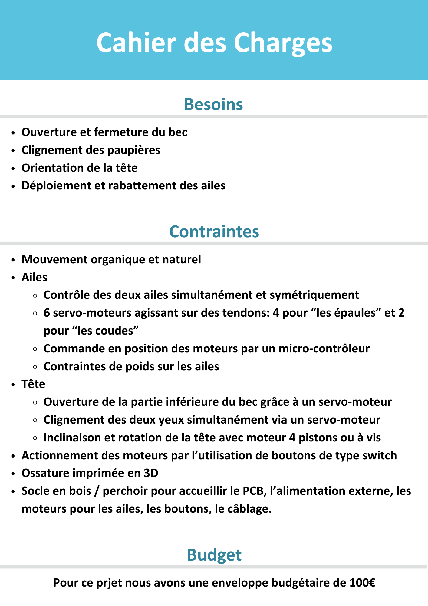

# DEA : Dynamic Eagle Animatronic
> Présentation du projet, cahier des charges, état de l'art, etc...

Depuis la Grêce antique et le mythe du géant de bronze Talos les hommes ont toujours cherchés à créer des automates avec les moyens à leur disposition. Les animatroniques sont l'achèvement actuel de ce désir. Ce sont des poupées mécaniques plus ou moins réalistes dont le fonctionnement interne fait intervenir autant de la mécanique que de l'électronique.
Elles sont depuis plusieurs décennies et encore aujourd'hui principalement utilisées dans le domaine du divertissement au travers des parcs d'attraction, des films et des séries.

Dans le cadre d'un projet de 1ère année à l'école d'ingénieur ENSEA supervisé par (@)M.Papazoglou nous allons créer créer une animatronique d'aigle en 10 séances de 4h. Cet animatronic sera
capable d'ouvrir et de rabattre ses ailes, d'ouvrir et de fermer ses paupières, d'ouvrir et de fermer son bec, de pivoter sa tête (optionnel). Ces mouvements seront commandés par
l'appui de différents boutons.

<table>
  <tr>
    <td></td>
    <td></td>
  </tr>
</table>

# Equipe
Membres de l'équipe : 
* Vincent Fernandes
    * [Github](https://github.com/FernandesVincent)
    * [Linkedin](https://www.linkedin.com/in/vincent-fernandes-0981552a6/)
* Maël Lukas
    * [Github](https://github.com/mael-lukas)
    * [Linkedin](https://www.linkedin.com/in/mael-lukas/)
* Romane Ponthieu
    * [Github](https://github.com/Romanepnth)
    * [Linkedin](https://www.linkedin.com/in/romane-ponthieu/)
* Marie Ceccaldi
    * [Github](https://github.com/mariececcaldi1)
    * [Linkedin](https://www.linkedin.com/in/marie-ceccaldi-887616300/)
* Sedrenn Labrousse
    * [Github](https://github.com/Sedrennl)
    * [Linkedin](https://www.linkedin.com/in/sédrenn-labrousse-24b2a5295/)
> Rajouter les liens vers vos linked in, github, etc...

# Journal de bord
> Déroulé séance par séance

## Séance 1
   Cette séance, étant la première, nous a servit à définir notre projet au travers de la création d'une première version d'un cahier des charges et d'un diagramme d'architecture. Afin de nous organiser au mieux au vu du temps disponible à la création de ce projet nous nous sommes directement répartit différentes tâches à réaliser durant les semaines qui suivent.
   * #### modélisation 3D de l'aigle
        * Sedrenn Labrousse
   * #### programmation des moteurs
        *  Maël Lukas
   * #### création des différents PCB
        * Romane Ponthieu
        * Marie Ceccaldi
        * Vincent Fernandes

## Séance 2
   Durant cette séance nous avons affiné notre cahier des charges et notre diagramme d'architecture disponible ci-dessous:

   Nous en avons déduis la nécessité d'avoir un minimum de 2 PCB afin de réaliser notre animatronique, le principal qui contiendrait le microprocesseur ainsi que différents connectiques tandis que le secondaire incorporerai principalement en son sein tout les régulateurs de tension nécessaire à l'actionnment des moteurs. [PCB](https://github.com/mael-lukas/2324_Projet1AB_Animatronic?tab=readme-ov-file#pcb)
   Pendant ce temps, Sedrenn et Maël se sont chargés de la commande des différents composants dont nous ne disposions pas à l'école.
   
## Séance 3
   Détermination du besoin d'un nouveau PCB pour pouvoir palcer des LED RGB au niveau des yeux de l'aigle.
   Détermination d'un socle 
   
## Séance 4
   Cette séance a permis la finalisation des schematic des 2 PCB crées sous Kicad et ainsi le passage à l'étape PCB editor pour les membres affectés à cette partie du projet.

## Séance 5
   Au cours de ces 4 heures M.Papazoglou a pu vérifier les 3 PCB et nous faire des retours pour que l'on puisse faire les dernières retouches pour ensuite pouvoir passer la commande.
   
   À ce moment là dans l'avancée du projet, toutes les réalisations énoncées à la séance 1 ont pu avancer comme il ce doit. Les pcb étaient en phase de finalisation, la programmation des moteurs a permis la commande d'un petit moteur tandis que les moteurs XL430 voyaient leur fichiers header être terminés. Finalement, la modélisation 3D...

## Séance 6
   Au cours de cette séance nous avons reçu les commandes de composants faites durant la séance 2 ainsi que les PCB qui ont donc pu être soudés durant ces 4 heures.
   Premier prototype de socle.
## Séance 7

## Séance 8
   Présentation orale (10min par groupe + 10min de question, total 1h max)
## Séance 9

## Séance 10
   Démonstration, bilan, rapport
# Livrables
## PCB
> Présentation du schéma (grandes lignes) + PCB

Ci-dessous les schematic et PCB editor des 3 PCB nécessaires à la réalisation du DEA:

#### Corps

Ce PCB est le PCB principal contenant le microprocesseur ainsi que les connecteurs et les bouttons utiles à l'utilisateur.

<table>
  <tr>
    <td></td>
    <td></td>
  </tr>
</table>

#### Tête

Ce PCB sert à réguler les tension envoyés aux moteurs et contient également le LED driver qui permet de commander les LED présentes sur le [PCB des yeux](https://github.com/mael-lukas/2324_Projet1AB_Animatronic/tree/main?tab=readme-ov-file#yeux).

<table>
  <tr>
    <td></td>
    <td></td>
  </tr>
</table>

#### Yeux

Ce PCB, utilisé deux fois dans le DEA (un pour chaque oeil) à pour unique utilité de placer les LED au plus proche des yeux grâce à un connecteur qui le relie au [PCB de la tête](https://github.com/mael-lukas/2324_Projet1AB_Animatronic/tree/main?tab=readme-ov-file#t%C3%AAte).

<table>
  <tr>
    <td></td>
    <td></td>
  </tr>
</table>

## Code
> Architecture de votre code

## Rendu final
> Video ici de votre projet

